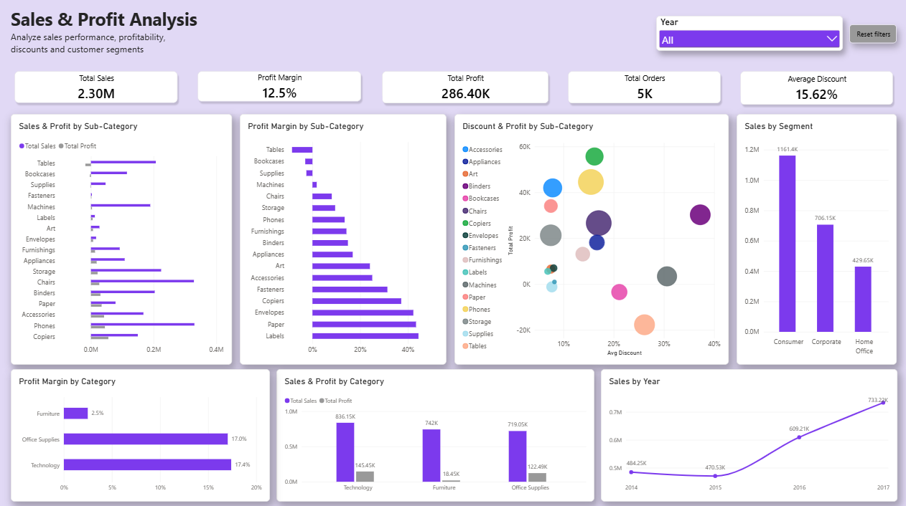
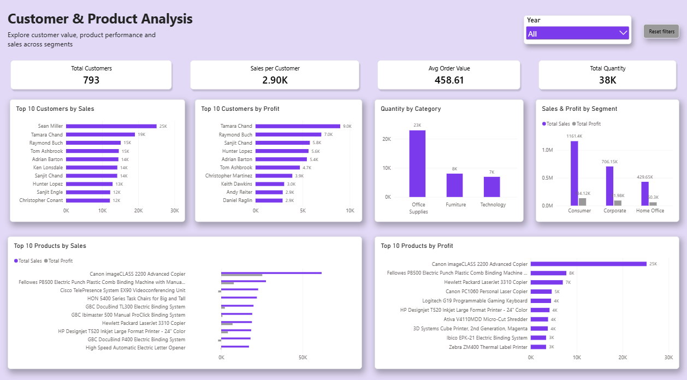
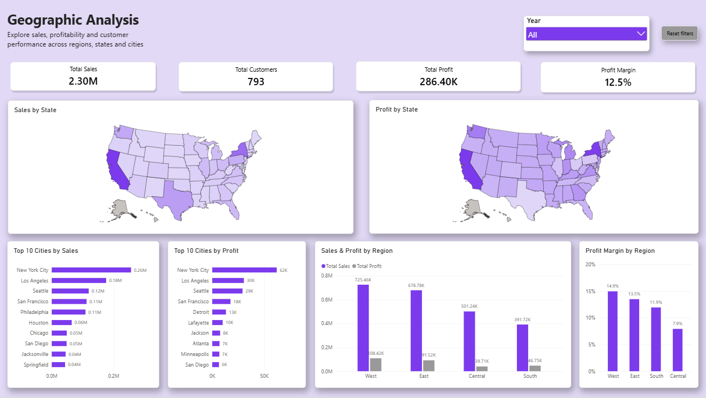
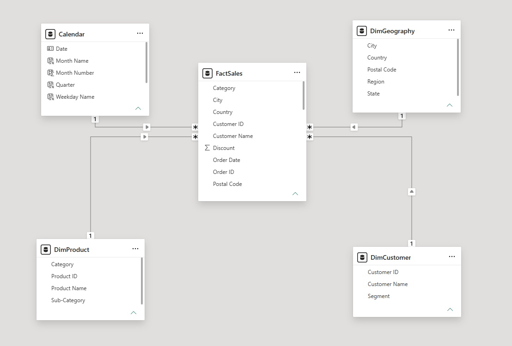
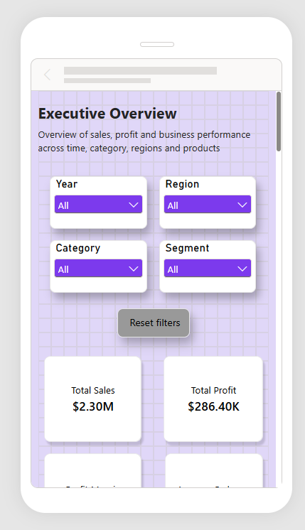
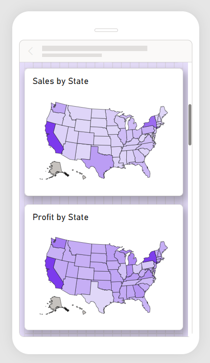
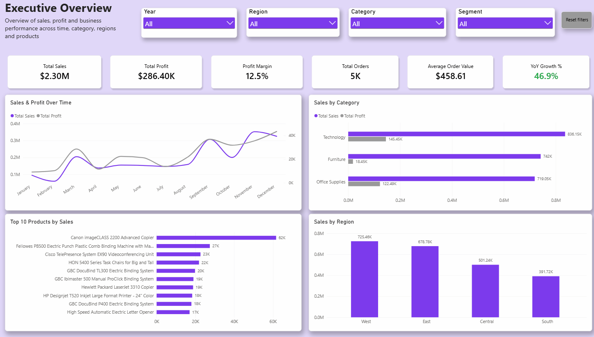

# Superstore Sales & Profit Analysis - Power BI Dashboard
I built this dashboard to dig into sales and profit data for retail chain called Superstore (2014-2017) - which categories, regions, and customers actually make money, and where things are quietly losing it.
## What I started with
One flat table with all the orders: sales, profit, discounts, customers, products, and locations, about 10K rows.
## What I did
I started with just that one messy table and turned it into something I could actually build reports on:
- Renamed it to `FactSales`
- Pulled out a separate `Calendar` table (dates, months, quarters, weekdays, years)
- Split the customer, product, and geography info into their own dimension tables - `DimCustomer`, `DimProduct`, `DimGeography` - and cleaned out the duplicates
- Connected everything into a star schema, so `FactSales` links out to `Calendar`, and the three dimension tables
Then I built out the measures I needed in DAX: totals for sales, profit, quantity, orders, and customers,  plus profit margin, average order value, average discount, sales per customer, and year-over-year comparisons (this year vs. last year, growth %).
With that in place, I built four report pages:
- **Executive Overview** = the big picture: sales, profit, margin, YoY growth, with filters for year, region, category, and segment
- **Sales & Profit Analysis** - how things break down by sub-category and category, plus how discounts relate to profit
- **Customer & Product Analysis** - top customers and products by sales and profit, and how segments compare
- **Geographic Analysis** - maps and rankings by state, city, and region
Finally, I set up a mobile layout for every page, so the dashboard isn't just a desktop thing - the cards and charts rearrange properly on a phone screen too.
## What I found
- **Strong overall growth**: The business generated $2.30M in sales and $286.4K in profit, with a 12,5% profit margin and 46.9% year-over-year sales growth.
- **Technology leads profitability**: Technology generated the highest sales ($836.2K) and profit ($145.5K), with a 17.4% profit margin. In contrast, Furniture generated $742K in sales but only $18.5K in profit, resulting in a significantly lower 2.5% margin.
- **Large variation across sub-categories**: Copiers generated the highest profit ($55.6K), while Tables recorded the largest loss at -$17.7K.
- **Discounting and profitability**: Higher discount levels are associated with weaker profitability in some sub-categories. Tables, for example, had an average discount of 26.1% and generated a loss of $17.7K.
- **High sales do not always mean high profitability**: Several top-selling products generated negative profit. For example, the Cisco TelePresence System EX90 generated $22.6K in sales but a loss of $1.8K.
- **Customer segments differ in value**: Consumer generated the highest sales ($1.16M) and profit ($134.1K), while Home Office had the highest profit margin at approximately 14% despite having the lowest sales volume.
- **Significant regional profitability gap**: West generated the highest sales ($725.5K) and profit ($108.4K), with the strongest margin at 15%. Central, despite generating solid sales ($501.2K), had the weakest margin in the region at just 7.9% - less than half of West's.
## Tools
Power BI Desktop, DAX, Power Query - star schema, custom measures, and a mobile-friendly layout.
## Screenshots

### Data Model

### Mobile Layout

|

|

### Demo

## Files
- [Superstore Sales & Profit Analysis.pbix](Superstore%20Sales%20&%20Profit%20Analysis.pbix) - download and open in Power BI Desktop to explore the interactive report
-`assets/` - screenshots and demo GIF  used in this README
## Data Source
This project uses the public Superstore sample dataset, commonly used for BI practice and portfolio projects.
